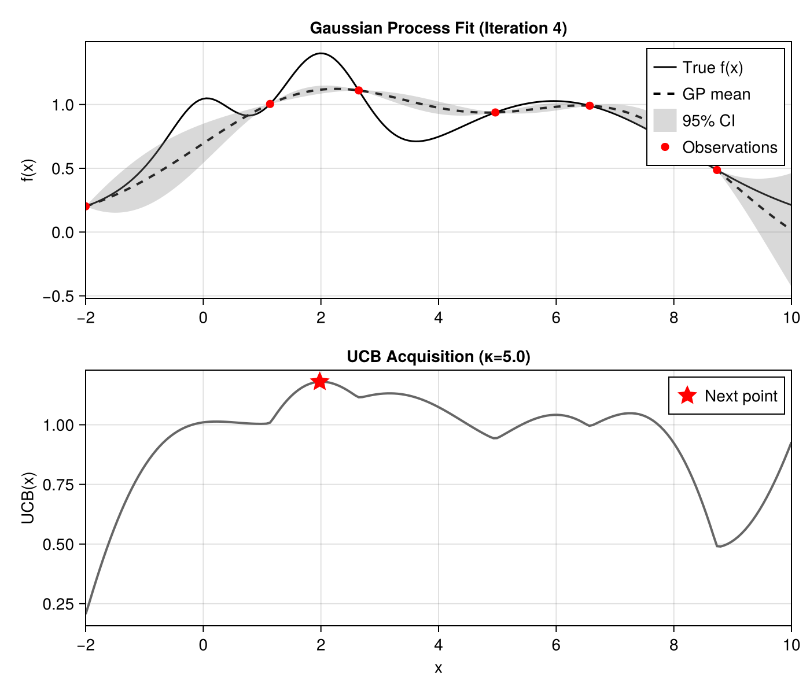

# Bayesian Optimization

This example demonstrates a simple Bayesian optimization workflow using laGP.jl as the GP surrogate model. The visualization style is inspired by [BayesianOptimization.jl](https://github.com/jbrea/BayesianOptimization.jl).

## Overview

Bayesian optimization is a sequential strategy for finding the optimum of expensive black-box functions. At each iteration:

1. **Fit a GP** to all observations collected so far
2. **Compute an acquisition function** that balances exploration vs exploitation
3. **Evaluate the objective** at the acquisition function's maximum
4. Repeat until budget exhausted

## Key Differences from BayesianOptimization.jl

| Feature | BayesianOptimization.jl | laGP.jl Approach |
|---------|------------------------|------------------|
| GP Backend | Custom/GPs.jl | AbstractGPs.jl |
| Acquisition | Built-in UCB, EI, etc. | Manual UCB implementation |
| Hyperparameters | Various methods | MLE via `mle_gp()` |
| Optimization | Integrated loop | Manual loop |

## Setup

```julia
using laGP
using CairoMakie
using Random
using Distributions: TDist, quantile

Random.seed!(11)
```

## Objective Function

We use a classic test function with a global maximum near x ≈ 2:

```julia
f(x) = exp(-(x - 2)^2) + exp(-(x - 6)^2 / 10) + 1 / (x^2 + 1)
```

Domain: [-2, 10]

## UCB Acquisition Function

The **Upper Confidence Bound** (UCB) acquisition function balances exploration and exploitation:

```math
\text{UCB}(x) = \mu(x) + \kappa \cdot \sigma(x)
```

where:
- μ(x) is the GP posterior mean (exploitation)
- σ(x) is the GP posterior standard deviation (exploration)
- κ controls the exploration-exploitation tradeoff

```julia
function ucb(mean, variance, κ=5.0)
    return mean .+ κ .* sqrt.(variance)
end
```

Higher κ values encourage more exploration of uncertain regions.

## Sequential Optimization

### Initial Observations

Start with 2 random points:

```julia
n_init = 2
X_obs = rand(n_init) .* 12 .- 2  # uniform in [-2, 10]
X_obs = reshape(X_obs, :, 1)
Y_obs = f.(X_obs[:, 1])
```

### Optimization Loop

```julia
# Prediction grid
x_grid = collect(range(-2, 10, length=200))
X_pred = reshape(x_grid, :, 1)

κ = 5.0  # UCB exploration parameter

for iter in 1:7
    # Fit GP with MLE
    d_range = darg(X_obs)
    gp = new_gp(X_obs, Y_obs, d_range.start, 1e-6)  # small nugget
    mle_gp(gp, :d; drange=(d_range.min, d_range.max), tmax=20)

    # Predict
    pred = pred_gp(gp, X_pred; lite=true)

    # Compute UCB and find next point
    ucb_vals = ucb(pred.mean, pred.s2, κ)
    x_next = x_grid[argmax(ucb_vals)]

    # Evaluate objective and add observation
    X_obs = vcat(X_obs, [x_next;;])
    Y_obs = vcat(Y_obs, f(x_next))
end
```

### Why Small Nugget?

Since our objective function is deterministic (noise-free), we use a small nugget (1e-6) for near-interpolation. For noisy objectives, increase the nugget or optimize it via `jmle_gp()`.

## Visualization

The two-panel visualization shows:

**Upper panel**: GP surrogate with 95% credible interval
- True function (solid black)
- GP mean (dashed black)
- 95% CI using Student-t distribution (gray band)
- Observations (red circles)

**Lower panel**: UCB acquisition function
- UCB values (dark gray line)
- Next evaluation point (red star)

```julia
function plot_bo_step(x_grid, pred, X_obs, Y_obs, ucb_vals, x_next, κ; iter=1)
    fig = Figure(size=(700, 600))

    # Upper panel: GP fit
    ax1 = Axis(fig[1, 1],
        title="Gaussian Process Fit (Iteration $iter)",
        ylabel="f(x)")

    lines!(ax1, x_grid, f.(x_grid), color=:black, linewidth=1.5, label="True f(x)")
    lines!(ax1, x_grid, pred.mean, color=:black, linestyle=:dash,
           linewidth=2, label="GP mean")

    # 95% CI using Student-t (correct for concentrated likelihood)
    t_crit = quantile(TDist(pred.df), 0.975)
    std_pred = sqrt.(pred.s2)
    lower = pred.mean .- t_crit .* std_pred
    upper = pred.mean .+ t_crit .* std_pred
    band!(ax1, x_grid, lower, upper, color=(:gray, 0.3), label="95% CI")

    scatter!(ax1, vec(X_obs), Y_obs, color=:red, marker=:circle,
             markersize=10, label="Observations")
    axislegend(ax1, position=:rt)

    # Lower panel: Acquisition function
    ax2 = Axis(fig[2, 1],
        title="UCB Acquisition (κ=$κ)",
        xlabel="x", ylabel="UCB(x)")

    lines!(ax2, x_grid, ucb_vals, color=:gray40, linewidth=2)
    scatter!(ax2, [x_next], [ucb_vals[argmax(ucb_vals)]],
             color=:red, marker=:star5, markersize=20, label="Next point")
    axislegend(ax2, position=:rt)

    return fig
end
```

### Why Student-t Distribution?

laGP uses a **concentrated (profile) likelihood** that marginalizes out the variance parameter τ². This means the posterior predictive distribution follows a Student-t distribution with `df = n` (number of training observations), not a Normal distribution. Using `TDist` gives more accurate credible intervals, especially with few observations.

## Results

The optimization converges to the global maximum near x ≈ 2 within 5-7 iterations.

### Iteration 0: Initial State

With only 2 random observations, the GP has high uncertainty. The UCB acquisition function explores the boundaries where uncertainty is highest.


### Iteration 4: Discovery

After a few iterations, the algorithm has discovered the peak near x ≈ 2 and begins exploiting it.



### Iteration 7: Convergence

By iteration 7, the GP accurately models the true function and the best observation is very close to the true optimum:

- **Best found**: x* = 1.98, f(x*) = 1.40
- **True optimum**: x* = 2.0, f(x*) = 1.40


## Running the Example

```bash
julia --project=. examples/bayesian_optimization.jl
```

This generates `bo_step_0.png` through `bo_step_7.png` in the `examples/` directory.

## Extensions

This basic example can be extended with:

- **Expected Improvement (EI)** acquisition function
- **Separable/ARD GP** via `new_gp_sep()` for multivariate optimization
- **Noisy objectives** with larger nugget optimized via `jmle_gp()`
- **Batch optimization** by selecting multiple points per iteration

## See Also

- [BayesianOptimization.jl](https://github.com/jbrea/BayesianOptimization.jl) - Full-featured BO package
- [Surrogates.jl](https://github.com/SciML/Surrogates.jl) - Various surrogate modeling methods
