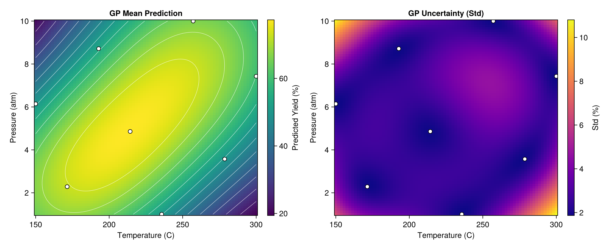
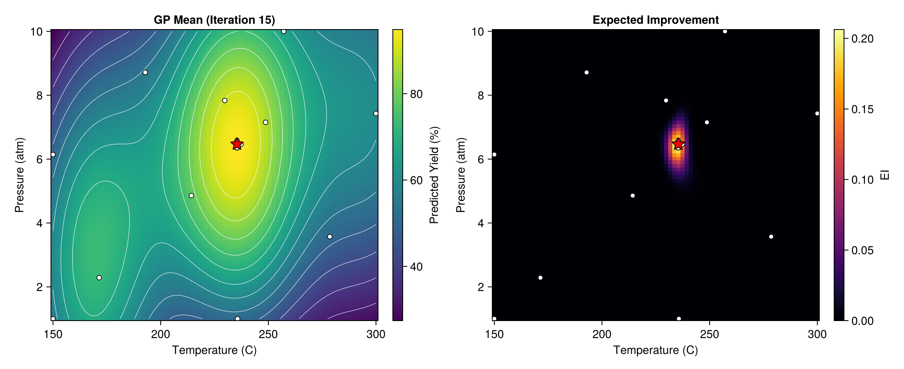

# Chemical Yield Optimization

This example demonstrates modern Response Surface Methodology (RSM) using a GP surrogate with Expected Improvement-based Bayesian Optimization, inspired by the pioneering work of George Box and K.B. Wilson (1951) on optimizing chemical manufacturing processes.

## The Manufacturing Problem

In chemical manufacturing, each experiment is expensive — requiring raw materials, reactor time, and lab analysis. The goal is to find operating conditions (temperature, pressure, catalyst loading, etc.) that maximize product yield using as few experiments as possible.

Classical RSM fits low-order polynomials to designed experiments. Here we replace the polynomial with a **separable GP surrogate** that:
- Captures nonlinear response surfaces without pre-specifying a model form
- Provides uncertainty estimates that guide where to experiment next
- Learns per-dimension sensitivity via ARD (Automatic Relevance Determination)

## Setup

```julia
using laGP
using CairoMakie
using Random
using Distributions: Normal, cdf, pdf
using LatinHypercubeSampling

Random.seed!(42)
```

## Yield Function

We define a synthetic 2D yield surface over Temperature (150-300 °C) and Pressure (1-10 atm) with three optima — a challenging multi-modal landscape:

```julia
function chemical_yield(T, P)
    t = (T - 150) / 150   # normalize to [0, 1]
    p = (P - 1) / 9

    # Global optimum: ~96% at T≈232, P≈6.5
    global_peak = 45.0 * exp(-25.0 * (t - 0.533)^2 - 8.0 * (p - 0.611)^2)

    # Local optimum 1: ~74% at T≈175, P≈2.8
    local1 = 26.0 * exp(-20.0 * (t - 0.167)^2 - 15.0 * (p - 0.20)^2)

    # Local optimum 2: ~73% at T≈275, P≈8.5
    local2 = 22.0 * exp(-18.0 * (t - 0.833)^2 - 12.0 * (p - 0.833)^2)

    return 48.0 + global_peak + local1 + local2
end
```

The global peak is narrow and anisotropic (temperature ~3× more sensitive than pressure), making it a good test for separable GPs.

### True Surface


The 3D view (left) reveals the multi-modal landscape. The contour plot (right) shows the global optimum near T≈232 °C, P≈6.5 atm, flanked by two weaker local optima.

## Expected Improvement

We implement the **Expected Improvement** (EI) acquisition function for maximization:

```math
\text{EI}(x) = (\mu(x) - f_{\text{best}}) \, \Phi(z) + \sigma(x) \, \phi(z), \quad z = \frac{\mu(x) - f_{\text{best}}}{\sigma(x)}
```

where ``\mu(x)`` and ``\sigma(x)`` are the GP posterior mean and standard deviation, ``f_{\text{best}}`` is the best observation so far, and ``\Phi``, ``\phi`` are the standard normal CDF and PDF.

```julia
function expected_improvement(mu, sigma, f_best)
    ei = zeros(length(mu))
    for i in eachindex(mu)
        if sigma[i] > 1e-10
            z = (mu[i] - f_best) / sigma[i]
            ei[i] = (mu[i] - f_best) * cdf(Normal(), z) + sigma[i] * pdf(Normal(), z)
        end
    end
    return ei
end
```

EI naturally balances **exploitation** (high predicted yield) with **exploration** (high uncertainty), preferring points that have the greatest expected improvement over the current best.

## Initial Design

We start with a Latin Hypercube Sample of 8 points — a space-filling design that ensures good coverage of the input space:

```julia
n_init = 8
plan, _ = LHCoptim(n_init, 2, 100)
X_coded = scaleLHC(plan, [(0.0, 1.0), (0.0, 1.0)])
Y_obs = [yield_coded(X_coded[i, 1], X_coded[i, 2]) for i in 1:n_init]
```


The 8 initial points (white circles) are spread across the input space. The best initial observation is **77.4%** — near a local optimum, far from the global peak of ~96%.

## Initial GP Surrogate

We fit a **separable GP** to the initial data using `new_gp_sep` and optimize hyperparameters via `jmle_gp_sep!`:

```julia
d_info = darg_sep(X_coded)
g_info = garg(Y_obs)

d_init = [d_info.ranges[1].start, d_info.ranges[2].start]
gp = new_gp_sep(X_coded, Y_obs, d_init, g_info.start)

drange = (d_info.ranges[1].min, d_info.ranges[1].max)
grange = (g_info.min, g_info.max)
jmle_gp_sep!(gp; drange=drange, grange=grange, verb=0)
```



With only 8 observations, the GP captures the general trend but has high uncertainty (right panel) in unexplored regions.

## Bayesian Optimization

At each iteration, we:
1. Rebuild the separable GP on all data collected so far
2. Predict on an 80×80 grid covering the input space
3. Compute EI at each grid point
4. Evaluate the yield at the EI-maximizing location

```julia
for iter in 1:15
    # Rebuild GP
    gp_i = new_gp_sep(X_bo, Y_bo, d_init_i, g_info_i.start)
    jmle_gp_sep!(gp_i; drange=drange_i, grange=grange_i, verb=0)

    # Predict and compute EI
    pred_i = pred_gp_sep(gp_i, XX; lite=true)
    ei_i = expected_improvement(pred_i.mean, sqrt.(pred_i.s2), maximum(Y_bo))

    # Next experiment at EI maximum
    x_next = XX[argmax(ei_i), :]
    y_next = yield_coded(x_next[1], x_next[2])

    X_bo = vcat(X_bo, x_next')
    Y_bo = vcat(Y_bo, y_next)
end
```

### Iteration 1: Discovery

The first BO iteration jumps from 77.4% to **94.3%** — EI directs the search straight to the global optimum region.


Left: GP mean prediction with the next evaluation point (red star). Right: EI heatmap showing where the algorithm expects the greatest improvement.

### Iteration 5: Refinement

By iteration 5, the GP has refined its estimate of the global peak. Best yield: **95.2%**.


### Iteration 10: Exploitation

With 18 total observations, the GP accurately models the global optimum region. EI is now concentrated on fine-tuning.


### Iteration 15: Convergence

Final best yield: **95.2%**, within 0.6% of the true optimum (95.8%).



## Final Surrogate

After all 23 experiments (8 initial + 15 BO), the GP accurately reconstructs the entire yield surface:


The three panels show: true yield surface (left), GP mean prediction with all observation locations (center), and GP uncertainty (right). Uncertainty is lowest near the global optimum where observations are concentrated.

## Convergence


BO finds near-optimal conditions in just **23 experiments** — compared to 100 for a naive 10×10 grid search. That's a **~4× reduction** in experimental cost.

## ARD Lengthscale Interpretation

The separable GP's per-dimension lengthscales reveal process sensitivity:

```
Final separable GP lengthscales:
  d[1] (Temperature) = 0.079
  d[2] (Pressure)    = 0.657
  Ratio d[2]/d[1]    = 8.3
```

A smaller lengthscale means the function varies more rapidly in that direction. Temperature's lengthscale is **~8× smaller** than Pressure's, confirming that yield is much more sensitive to temperature changes — a valuable insight for process control.

## Running the Example

```bash
julia --project=examples examples/chemical_yield_rsm.jl
```

This generates 9 PNG files in the `examples/` directory.

## Extensions

- **Noisy observations**: Increase the nugget or optimize it via `jmle_gp_sep!()` to handle measurement noise
- **Higher dimensions**: Add catalyst type, flow rate, etc. — ARD automatically identifies which matter
- **Batch BO**: Select multiple points per iteration for parallel experiments
- **Constraints**: Incorporate safety constraints (e.g., max pressure, min yield threshold)

## See Also

- [Bayesian Optimization](bayesian_optimization.md) — 1D BO example with UCB acquisition
- [Multivariate Inputs (ARD)](multivariate.md) — Isotropic vs separable GP comparison
- Box, G.E.P. and Wilson, K.B. (1951). "On the Experimental Attainment of Optimum Conditions." *Journal of the Royal Statistical Society B*, 13(1), 1–45.
