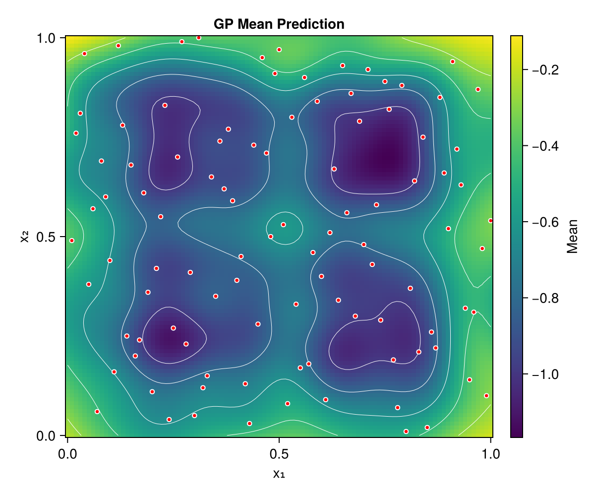
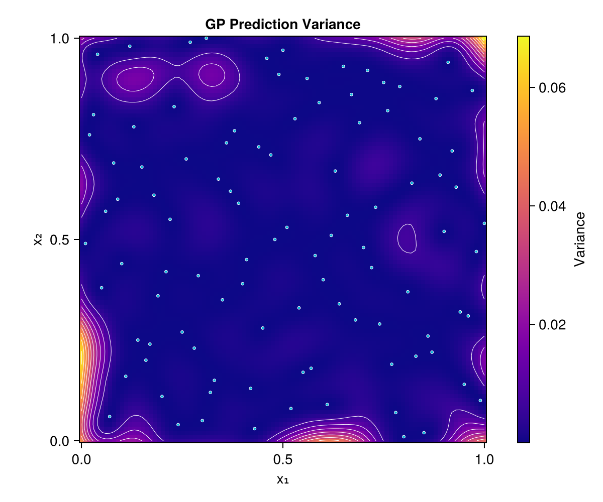
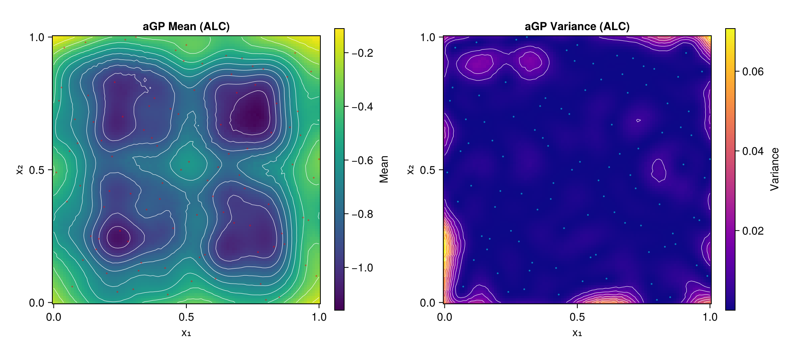
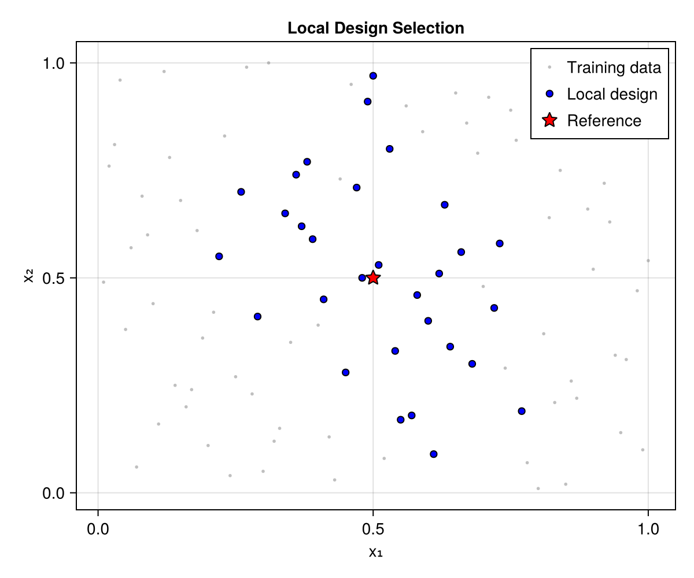

# Local Approximate GP Demo

This example demonstrates the core laGP.jl workflow, adapted from the R laGP package demo.

## Overview

We will:
1. Build a full GP model on a 2D test function
2. Make predictions with local approximate GP
3. Compare different acquisition methods

## Setup

```julia
using laGP
using Random
using LatinHypercubeSampling
using Statistics: mean

Random.seed!(42)
```

## Test Function

We use a modified Ackley-like function with interesting local structure:

```julia
function f2d(X::Matrix)
    x = X[:, 1]
    y = X[:, 2]

    g(z) = exp.(-(z .- 1).^2) .+ exp.(-0.8 .* (z .+ 1).^2) .- 0.05 .* sin.(8 .* (z .+ 0.1))

    return -g(x) .* g(y)
end
```

## Generate Training Data

Create a Latin Hypercube design:

```julia
n_train = 100
plan, _ = LHCoptim(n_train, 2, 10)
X_train = Matrix{Float64}(plan ./ n_train)

# Scale to [-2, 2] for f2d
X_scaled = 4.0 .* (X_train .- 0.5)
Z_train = f2d(X_scaled)

println("Training data: $(n_train) points")
println("Response range: [$(minimum(Z_train)), $(maximum(Z_train))]")
```

## Create Test Grid

```julia
n_test_side = 100
x_test = range(0.0, 1.0, length=n_test_side)
X_test = Matrix{Float64}(undef, n_test_side^2, 2)

idx = 1
for j in 1:n_test_side
    for i in 1:n_test_side
        X_test[idx, 1] = x_test[i]
        X_test[idx, 2] = x_test[j]
        idx += 1
    end
end

println("Test grid: $(n_test_side^2) points")
```

## Full GP Model

First, build a full GP for comparison:

```julia
# Estimate hyperparameters
d_range = darg(X_train)
g_range = garg(Z_train)

println("Lengthscale range: $(d_range.min) to $(d_range.max)")
println("Nugget range: $(g_range.min) to $(g_range.max)")

# Create and fit GP
gp = new_gp(X_train, Z_train, d_range.start, g_range.start)
jmle_gp(gp; drange=(d_range.min, d_range.max), grange=(g_range.min, g_range.max))

println("Optimized: d=$(gp.d), g=$(gp.g)")
println("Log-likelihood: $(llik_gp(gp))")

# Predict on test grid
pred_full = pred_gp(gp, X_test; lite=true)
```

The full GP provides smooth predictions over the entire domain:



The variance surface shows uncertainty, which is lowest near training data:



## Local Approximate GP

Now use aGP with different acquisition methods:

```julia
# ALC method (best accuracy)
result_alc = agp(X_train, Z_train, X_test;
    start=6, endpt=50,
    d=(start=gp.d, mle=false),
    g=(start=gp.g, mle=false),
    method=:alc
)

# NN method (fastest)
result_nn = agp(X_train, Z_train, X_test;
    start=6, endpt=50,
    d=(start=gp.d, mle=false),
    g=(start=gp.g, mle=false),
    method=:nn
)
```

The aGP predictions are nearly indistinguishable from the full GP:



## Compare Results

```julia
# True values for comparison
true_vals = f2d(4.0 .* (X_test .- 0.5))

# RMSE comparison
rmse_full = sqrt(mean((pred_full.mean .- true_vals).^2))
rmse_alc = sqrt(mean((result_alc.mean .- true_vals).^2))
rmse_nn = sqrt(mean((result_nn.mean .- true_vals).^2))

println("RMSE Comparison:")
println("  Full GP: $(round(rmse_full, digits=6))")
println("  aGP ALC: $(round(rmse_alc, digits=6))")
println("  aGP NN:  $(round(rmse_nn, digits=6))")
```

Side-by-side comparison of full GP vs local approximate GP predictions:


## Local Design Visualization

Examine which points are selected for a specific prediction location:

```julia
# Single prediction at center
Xref = [0.5, 0.5]
lagp_result = lagp(Xref, 6, 30, X_train, Z_train;
    d=gp.d, g=gp.g, method=:alc
)

println("Local design size: $(length(lagp_result.indices))")
println("Prediction: mean=$(lagp_result.mean), var=$(lagp_result.var)")
```

The local design shows which training points were selected for predicting at the center:



The test function itself has interesting structure with constraints:


## Key Observations

1. **Full GP vs Local**: For smooth functions, full GP and aGP produce similar predictions
2. **ALC vs NN**: ALC typically provides better accuracy by selecting informative points
3. **Computation**: aGP scales better for large datasets (local designs are small)
4. **Hyperparameters**: Using MLE-optimized parameters from a full GP subset works well

## Next Steps

- Try different `start` and `endpt` values
- Enable local MLE with `d=(start=..., mle=true)`
- Use `:mspe` method for a balance of speed and accuracy
