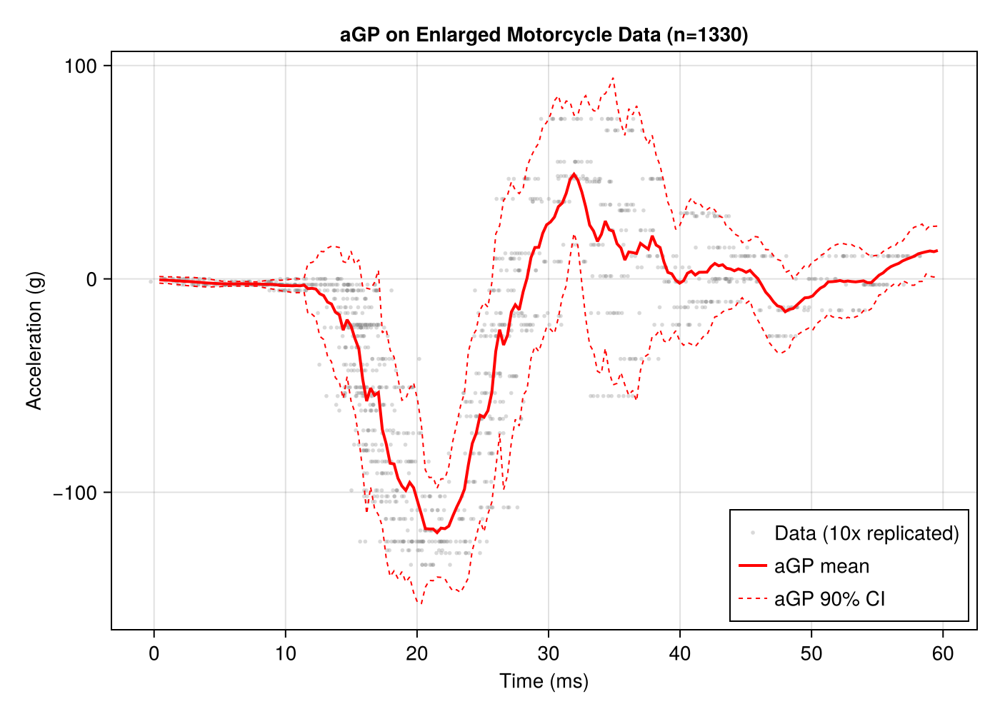

# Motorcycle Crash Test Example

This example demonstrates fitting both a full GP and local approximate GP (aGP) to the classic motorcycle crash test dataset, reproducing results from the R laGP package.

## Overview

We will:
1. Fit a full GP to the mcycle dataset (133 observations)
2. Compare with local approximate GP (aGP) predictions
3. Scale to a larger dataset using fixed hyperparameters

The mcycle dataset contains head acceleration (g) measurements at various times (ms) after a simulated motorcycle crash.

## Setup

```julia
using laGP
using Distributions
using Random
using CairoMakie
```

## Dataset

The mcycle dataset from the MASS R package contains 133 observations:

```julia
# Embedded mcycle dataset (times in ms, acceleration in g)
X = reshape(mcycle_times, :, 1)  # 133 x 1 design matrix
Z = mcycle_accel                  # 133 response values

println("Motorcycle Crash Test Data")
println("  Observations: ", length(Z))
println("  Time range: ", minimum(X), " - ", maximum(X), " ms")
println("  Accel range: ", minimum(Z), " - ", maximum(Z), " g")
```

## Data-Driven Parameter Initialization

Use `darg` and `garg` to get sensible parameter ranges:

```julia
# Get data-driven parameter ranges
da = darg(X)
ga = garg(Z)

println("Data-driven parameter ranges:")
println("  d: start=", round(da.start, digits=4),
        ", min=", round(da.min, digits=4),
        ", max=", round(da.max, digits=4))
println("  g: start=", round(ga.start, digits=4),
        ", min=", round(ga.min, digits=6),
        ", max=", round(ga.max, digits=4))
```

## Full GP with Joint MLE

Fit a full GP and optimize both lengthscale (d) and nugget (g):

```julia
# Create GP with data-driven initial values
gp = new_gp(X, Z, da.start, ga.start)

# Joint MLE for both d and g
result = jmle_gp(gp; drange=(da.min, da.max), grange=(ga.min, ga.max))

println("MLE results:")
println("  d = ", round(gp.d, digits=4))
println("  g = ", round(gp.g, digits=4))
println("  iterations = ", result.tot_its)
```

## Local Approximate GP (aGP)

The `agp` function builds local GP models at each prediction point using nearest neighbors:

```julia
# Prediction grid
xx = collect(range(minimum(X) - 2, maximum(X) + 2, length=200))
XX = reshape(xx, :, 1)

# Run aGP with MLE for both d and g
# Use NamedTuples to enable MLE optimization at each prediction point
d_agp = (start=da.start, min=da.min, max=da.max, mle=true)
g_agp = (start=ga.start, min=ga.min, max=ga.max, mle=true)

pred_agp = agp(X, Z, XX; endpt=30, d=d_agp, g=g_agp, method=:alc, verb=0)

println("aGP prediction complete")
println("  Test points: ", length(xx))
println("  Local neighborhood size: 30")
```

## Comparison: Full GP vs aGP

```julia
# Full GP predictions
pred_full_gp = pred_gp(gp, XX; lite=true)

# 90% credible intervals
z_90 = quantile(Normal(), 0.95)

# Full GP intervals
gp_lower = pred_full_gp.mean .- z_90 .* sqrt.(pred_full_gp.s2)
gp_upper = pred_full_gp.mean .+ z_90 .* sqrt.(pred_full_gp.s2)

# aGP intervals
agp_lower = pred_agp.mean .- z_90 .* sqrt.(pred_agp.var)
agp_upper = pred_agp.mean .+ z_90 .* sqrt.(pred_agp.var)
```

### Visualization

```julia
fig = Figure(size=(700, 500))

ax = Axis(fig[1, 1],
          xlabel="Time (ms)",
          ylabel="Acceleration (g)",
          title="GP vs aGP Comparison")

# Data points
scatter!(ax, vec(X), Z, color=:black, markersize=6)

# Full GP: black solid mean, black dashed CIs
lines!(ax, xx, pred_full_gp.mean, color=:black, linewidth=2, label="GP mean")
lines!(ax, xx, gp_lower, color=:black, linewidth=1, linestyle=:dash, label="GP 90% CI")
lines!(ax, xx, gp_upper, color=:black, linewidth=1, linestyle=:dash)

# aGP: red solid mean, red dashed CIs
lines!(ax, xx, pred_agp.mean, color=:red, linewidth=2, label="aGP mean")
lines!(ax, xx, agp_lower, color=:red, linewidth=1, linestyle=:dash, label="aGP 90% CI")
lines!(ax, xx, agp_upper, color=:red, linewidth=1, linestyle=:dash)

axislegend(ax, position=:rb)

fig
```


The full GP (black) and aGP (red) predictions are nearly identical for this dataset size. The aGP approach becomes advantageous for larger datasets where full GP computation is prohibitive.

## Scaling to Larger Datasets

When scaling to larger datasets, use **fixed hyperparameters** from the original MLE rather than re-optimizing. This matches the R laGP approach and prevents overfitting:

```julia
# Replicate data 10 times with jitter on X
Random.seed!(42)
n_rep = 10
X_big = repeat(X, n_rep) .+ randn(n * n_rep) .* 1.0  # Jitter on X (sd=1)
Z_big = repeat(Z, n_rep)                              # No noise on Z

println("Enlarged dataset:")
println("  Observations: ", length(Z_big))  # 1330 observations

# aGP with FIXED hyperparameters from the full GP MLE
# This matches R: aGP(X, Z, XX, end = 30, d = d, g = g, verb = 0)
pred_agp_big = agp(X_big, Z_big, XX; endpt=30, d=gp.d, g=gp.g,
                   method=:alc, verb=0)
```

### Visualization

```julia
fig2 = Figure(size=(700, 500))

ax = Axis(fig2[1, 1],
          xlabel="Time (ms)",
          ylabel="Acceleration (g)",
          title="aGP on Enlarged Motorcycle Data (n=1330)")

scatter!(ax, vec(X_big), Z_big, color=(:gray, 0.3), markersize=4,
         label="Data (10x replicated)")
lines!(ax, xx, pred_agp_big.mean, color=:red, linewidth=2, label="aGP mean")

# 90% credible intervals
agp_big_lower = pred_agp_big.mean .- z_90 .* sqrt.(pred_agp_big.var)
agp_big_upper = pred_agp_big.mean .+ z_90 .* sqrt.(pred_agp_big.var)
lines!(ax, xx, agp_big_lower, color=:red, linewidth=1, linestyle=:dash, label="aGP 90% CI")
lines!(ax, xx, agp_big_upper, color=:red, linewidth=1, linestyle=:dash)

axislegend(ax, position=:rb)

fig2
```



## Key Concepts

### Fixed vs Adaptive Hyperparameters

When using `agp` with a NamedTuple like `(start=..., min=..., max=..., mle=true)`, MLE optimization runs at each prediction point. This is appropriate for the original dataset.

For enlarged/replicated datasets, pass fixed scalar values (`d=gp.d, g=gp.g`) to use hyperparameters estimated from the original data. This:
- Prevents overfitting to artificial replication structure
- Matches the R laGP approach
- Produces smoother predictions

### aGP Parameters

- `endpt`: Maximum local neighborhood size (default 50)
- `method`: Acquisition function for neighbor selection
  - `:alc` - Active Learning Cohn (reduces predictive variance)
  - `:mspe` - Mean Squared Prediction Error
  - `:nn` - Simple nearest neighbors
- `verb`: Verbosity level (0 = silent)

### When to Use aGP

- **Large datasets**: O(n) per prediction vs O(n³) for full GP
- **Non-stationary functions**: Local models adapt to local structure
- **Streaming data**: Can update local neighborhoods efficiently
