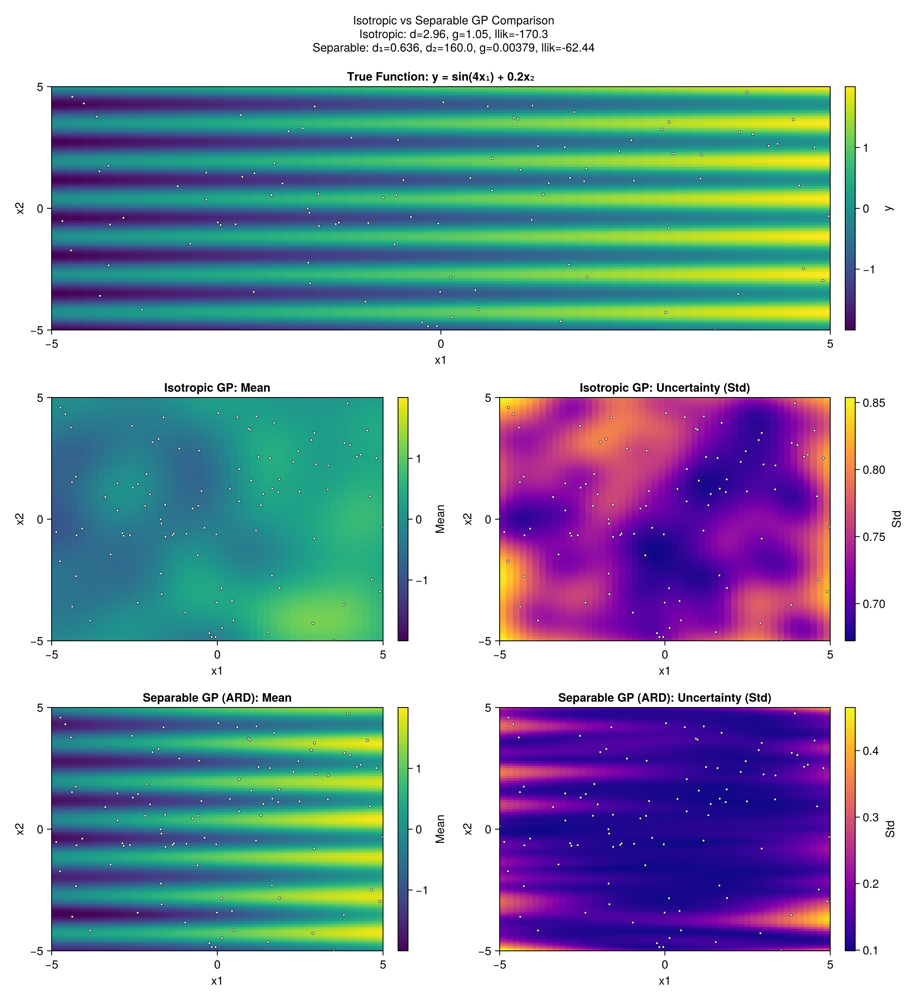

# Multivariate Inputs with ARD

This example demonstrates how to fit a **separable GP** (also known as ARD - Automatic Relevance Determination) to multi-dimensional input data, allowing the model to learn different lengthscales for each input dimension. We also compare it to an **isotropic GP** to show why ARD is beneficial for anisotropic functions.

## Why Per-Dimension Lengthscales?

In standard (isotropic) GPs, a single lengthscale parameter controls how quickly the function varies across *all* input dimensions. This assumes the function changes at the same rate regardless of direction - an **isotropic** assumption.

However, real-world functions are often **anisotropic**: they vary more rapidly in some directions than others. Consider:

- A function of (temperature, pressure) where small temperature changes have large effects but pressure changes matter less
- A spatial process where north-south correlation differs from east-west
- Any problem where some inputs are more "relevant" than others

The **separable GP** (or ARD kernel) addresses this by assigning a separate lengthscale `d[k]` to each input dimension `k`. The kernel becomes:

```
k(x, x') = exp(-Σₖ (xₖ - x'ₖ)² / dₖ)
```

A **smaller lengthscale** means the function varies more rapidly in that dimension (high sensitivity), while a **larger lengthscale** means smoother variation (low sensitivity). After fitting, the relative magnitudes of the lengthscales reveal which inputs matter most - hence "Automatic Relevance Determination."

## The Problem with Isotropic

When the true function is anisotropic, an isotropic GP must pick a single "compromise" lengthscale that:

- Is **too large** for dimensions with rapid variation (underfitting those directions)
- Is **too small** for dimensions with slow variation (overfitting noise in those directions)

This leads to suboptimal predictions and a lower log-likelihood compared to a separable GP that can adapt to each dimension independently.

## Setup

```julia
using laGP
using Random
using CairoMakie
```

## Generate Training Data

We use a 2D test function with **extreme anisotropy**:

```julia
# Target function: y = sin(4*x₁) + 0.2*x₂ + noise
# Extreme anisotropy:
# - Fast oscillations in x₁ (needs small lengthscale)
# - Nearly linear in x₂ (needs large lengthscale)

Random.seed!(48392)

n = 100
X = -5.0 .+ 10.0 .* rand(n, 2)  # Uniform on [-5, 5]²

yerr = 0.1
y = sin.(4 .* X[:, 1]) .+ 0.2 .* X[:, 2] .+ yerr .* randn(n)

println("Training data: $n points in 2D, noise σ = $yerr")
```

## Initialize Hyperparameters

Use data-driven initialization for the lengthscales and nugget:

```julia
# darg_sep returns ranges suitable for separable GP
# darg returns ranges suitable for isotropic GP
d_info_sep = darg_sep(X)
d_info_iso = darg(X)
g_info = garg(y)

println("Separable lengthscale range: [$(d_info_sep.ranges[1].min), $(d_info_sep.ranges[1].max)]")
println("Isotropic lengthscale range: [$(d_info_iso.min), $(d_info_iso.max)]")
println("Nugget range: [$(g_info.min), $(g_info.max)]")

# Set up optimization ranges
grange = (g_info.min, g_info.max)
```

## Fit Isotropic GP

First, let's fit an isotropic GP to see its limitations:

```julia
# Create isotropic GP (single lengthscale for all dimensions)
gp_iso = new_gp(X, y, d_info_iso.start, g_info.start)

# Optimize via joint MLE
drange_iso = (d_info_iso.min, d_info_iso.max)
result_iso = jmle_gp!(gp_iso; drange=drange_iso, grange=grange, verb=0)

println("Isotropic GP:")
println("  d = $(round(gp_iso.d, sigdigits=4))")
println("  g = $(round(gp_iso.g, sigdigits=4))")
println("  log-likelihood = $(round(llik_gp(gp_iso), sigdigits=4))")
```

The isotropic GP finds a single lengthscale that must serve all dimensions. This is a compromise value.

## Fit Separable GP

Now fit a separable GP that can learn per-dimension lengthscales:

```julia
# Initial lengthscales (same for both dimensions)
d_init = [d_info_sep.ranges[1].start, d_info_sep.ranges[2].start]

# Create GP with per-dimension lengthscales
gp_sep = new_gp_sep(X, y, d_init, g_info.start)

# Joint MLE optimization
drange_sep = (d_info_sep.ranges[1].min, d_info_sep.ranges[1].max)
result_sep = jmle_gp_sep!(gp_sep; drange=drange_sep, grange=grange, verb=0)

println("Separable GP:")
println("  d = $(round.(gp_sep.d, sigdigits=4))")
println("  g = $(round(gp_sep.g, sigdigits=4))")
println("  log-likelihood = $(round(llik_gp_sep(gp_sep), sigdigits=4))")
```

## Comparing the Results

Let's compare the two models:

```julia
llik_iso = llik_gp(gp_iso)
llik_sep = llik_gp_sep(gp_sep)

println("Log-likelihood comparison:")
println("  Isotropic:  $(round(llik_iso, sigdigits=5))")
println("  Separable:  $(round(llik_sep, sigdigits=5))")
println("  Difference: $(round(llik_sep - llik_iso, sigdigits=4)) (separable is better)")

println("\nLengthscale comparison:")
println("  Isotropic d = $(round(gp_iso.d, sigdigits=4)) (single value)")
println("  Separable d = $(round.(gp_sep.d, sigdigits=4)) (per-dimension)")
```

Key observations:

1. **Higher log-likelihood**: The separable GP achieves a better fit to the data
2. **Compromise lengthscale**: The isotropic `d` falls between the separable `d[1]` and `d[2]`
3. **Captured anisotropy**: The separable GP correctly identifies that x₁ needs a shorter lengthscale (faster variation) than x₂

## Interpreting the Lengthscales

The optimized lengthscales reveal the function's anisotropic structure:

```julia
println("Lengthscale interpretation:")
println("  d[1] (x₁ dimension) = $(round(gp_sep.d[1], sigdigits=4))")
println("  d[2] (x₂ dimension) = $(round(gp_sep.d[2], sigdigits=4))")

if gp_sep.d[1] < gp_sep.d[2]
    ratio = gp_sep.d[2] / gp_sep.d[1]
    println("  → x₁ is $(round(ratio, sigdigits=2))x more sensitive (smaller lengthscale)")
end
```

For our test function `sin(4*x₁) + 0.2*x₂`, we expect `d[1] << d[2]` because:
- The `sin(4*x₁)` term creates fast oscillations along the x₁ axis
- The `0.2*x₂` term is nearly linear - very slow variation in x₂

The MLE correctly identifies this extreme anisotropy: x₁ requires a much shorter lengthscale to capture the rapid oscillations, while x₂ needs a large lengthscale for its gentle linear trend.

## Prediction

```julia
# Create prediction grid
n_x1, n_x2 = 100, 50
x1_grid = range(-5, 5, length=n_x1)
x2_grid = range(-5, 5, length=n_x2)

# Build test matrix
XX = Matrix{Float64}(undef, n_x1 * n_x2, 2)
let idx = 1
    for j in 1:n_x2
        for i in 1:n_x1
            XX[idx, 1] = x1_grid[i]
            XX[idx, 2] = x2_grid[j]
            idx += 1
        end
    end
end

# True function (no noise) for reference
y_true = sin.(4 .* XX[:, 1]) .+ 0.2 .* XX[:, 2]
true_grid = reshape(y_true, n_x1, n_x2)

# Get predictions for both GPs
pred_iso = pred_gp(gp_iso, XX; lite=true)
pred_sep = pred_gp_sep(gp_sep, XX; lite=true)

# Reshape for plotting
mean_iso_grid = reshape(pred_iso.mean, n_x1, n_x2)
std_iso_grid = reshape(sqrt.(pred_iso.s2), n_x1, n_x2)
mean_sep_grid = reshape(pred_sep.mean, n_x1, n_x2)
std_sep_grid = reshape(sqrt.(pred_sep.s2), n_x1, n_x2)
```

## Visualization

```julia
fig = Figure(size=(1100, 1200))

# Use consistent colormap limits based on true function range
clims = (minimum(y_true), maximum(y_true))

# Row 1: True function (reference)
ax_true = Axis(fig[1, 1:3], xlabel="x₁", ylabel="x₂",
               title="True Function: y = sin(4x₁) + 0.2x₂")
hm_true = heatmap!(ax_true, collect(x1_grid), collect(x2_grid), true_grid',
                   colormap=:viridis, colorrange=clims)
scatter!(ax_true, X[:, 1], X[:, 2], color=:white, markersize=4,
         strokecolor=:black, strokewidth=0.5)
Colorbar(fig[1, 4], hm_true, label="y")

# Row 2: Isotropic GP
ax1 = Axis(fig[2, 1], xlabel="x₁", ylabel="x₂", title="Isotropic GP: Mean")
hm1 = heatmap!(ax1, collect(x1_grid), collect(x2_grid), mean_iso_grid',
               colormap=:viridis, colorrange=clims)
scatter!(ax1, X[:, 1], X[:, 2], color=:white, markersize=4,
         strokecolor=:black, strokewidth=0.5)
Colorbar(fig[2, 2], hm1, label="Mean")

ax2 = Axis(fig[2, 3], xlabel="x₁", ylabel="x₂", title="Isotropic GP: Uncertainty (Std)")
hm2 = heatmap!(ax2, collect(x1_grid), collect(x2_grid), std_iso_grid', colormap=:plasma)
scatter!(ax2, X[:, 1], X[:, 2], color=:white, markersize=4,
         strokecolor=:black, strokewidth=0.5)
Colorbar(fig[2, 4], hm2, label="Std")

# Row 3: Separable GP
ax3 = Axis(fig[3, 1], xlabel="x₁", ylabel="x₂", title="Separable GP (ARD): Mean")
hm3 = heatmap!(ax3, collect(x1_grid), collect(x2_grid), mean_sep_grid',
               colormap=:viridis, colorrange=clims)
scatter!(ax3, X[:, 1], X[:, 2], color=:white, markersize=4,
         strokecolor=:black, strokewidth=0.5)
Colorbar(fig[3, 2], hm3, label="Mean")

ax4 = Axis(fig[3, 3], xlabel="x₁", ylabel="x₂", title="Separable GP (ARD): Uncertainty (Std)")
hm4 = heatmap!(ax4, collect(x1_grid), collect(x2_grid), std_sep_grid', colormap=:plasma)
scatter!(ax4, X[:, 1], X[:, 2], color=:white, markersize=4,
         strokecolor=:black, strokewidth=0.5)
Colorbar(fig[3, 4], hm4, label="Std")

# Summary labels
iso_label = "Isotropic: d=$(round(gp_iso.d, sigdigits=3)), llik=$(round(llik_iso, sigdigits=4))"
sep_label = "Separable: d₁=$(round(gp_sep.d[1], sigdigits=3)), d₂=$(round(gp_sep.d[2], sigdigits=3)), llik=$(round(llik_sep, sigdigits=4))"

Label(fig[0, :], "Isotropic vs Separable GP Comparison\n$iso_label\n$sep_label", fontsize=14)

fig
```



The comparison shows:
- **Row 1 (True Function)**: The ground truth with fast oscillations in x₁ and a gentle linear trend in x₂
- **Row 2 (Isotropic)**: The isotropic GP completely misses the oscillations - it treats them as noise (notice the huge nugget). The surface is nearly flat.
- **Row 3 (Separable)**: The separable GP correctly captures the oscillating pattern by using a small lengthscale for x₁ and a large lengthscale for x₂

## Summary: Isotropic vs Separable

| Metric | Isotropic | Separable |
|--------|-----------|-----------|
| Lengthscale(s) | Single d (compromise) | d₁ (small), d₂ (large) |
| Log-likelihood | Lower | Higher |
| Captures anisotropy | No | Yes |
| Parameters | 2 (d, g) | m+1 (d[1], ..., d[m], g) |

## Key Concepts

### Isotropic vs Separable (ARD) Kernels

| Property | Isotropic (`GP`) | Separable (`GPsep`) |
|----------|------------------|---------------------|
| Lengthscale | Single `d` for all dimensions | Vector `d[1:m]` per dimension |
| Assumption | Function varies equally in all directions | Function can vary differently per dimension |
| Parameters | 2 (d, g) | m+1 (d[1], ..., d[m], g) |
| Use when | Dimensions are interchangeable | Dimensions have different relevance |

### When to Use ARD

Use `GPsep` (separable/ARD) when:

- **Input dimensions have different scales or units** - e.g., mixing temperature (°C) and concentration (mol/L)
- **Some inputs may be irrelevant** - ARD can discover this via large lengthscales
- **Physical intuition suggests anisotropy** - directional processes, hierarchical effects
- **Variable importance is of interest** - lengthscale ratios indicate relative sensitivity

Use `GP` (isotropic) when:

- **Dimensions are exchangeable** - e.g., spatial coordinates with no preferred direction
- **Limited data** - fewer parameters means less overfitting risk
- **Computational efficiency** - isotropic kernels can be slightly faster

### Practical Notes

1. **Initialization**: Both dimensions start with the same lengthscale. The optimizer then differentiates them based on the data.

2. **Identifiability**: With very little data, ARD lengthscales may not be well-determined. Consider isotropic GP if you have fewer than ~10 points per dimension.

3. **Scaling inputs**: For best results, normalize inputs to similar ranges before fitting. This prevents numerical issues and makes lengthscale magnitudes comparable.

4. **Nugget estimation**: The nugget `g` captures observation noise plus any unmodeled small-scale variation. A larger nugget indicates noisier data or model misspecification.
