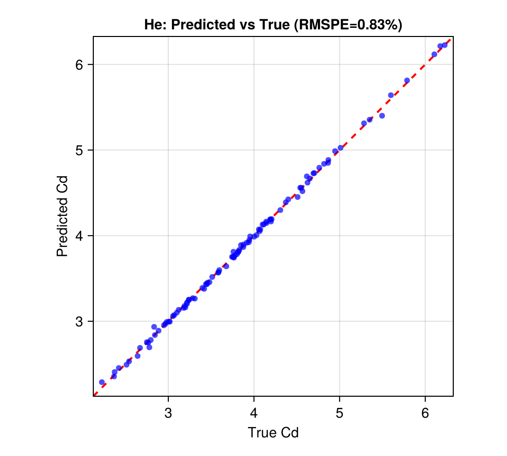
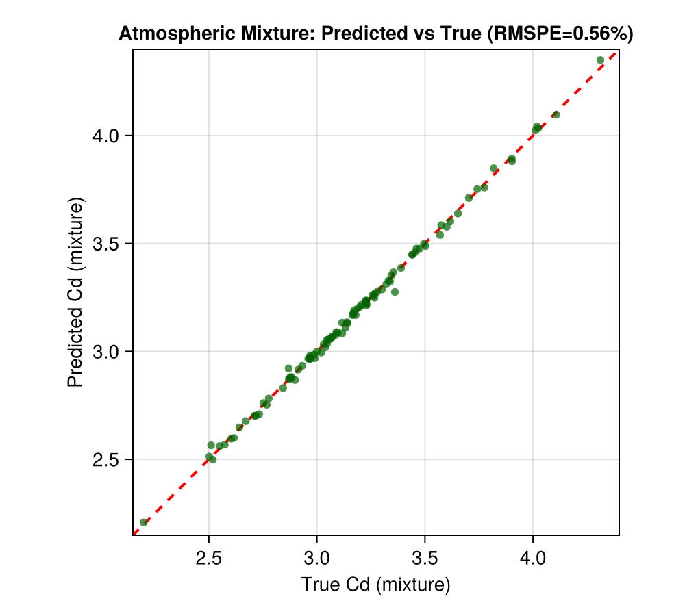

# Satellite Drag Modeling Example

This example demonstrates GP surrogate modeling for GRACE satellite drag coefficients, based on Chapter 2 of "Surrogates" by Robert Gramacy.

## Overview

We will:
1. Load GRACE satellite drag coefficient data
2. Fit separable GPs for multiple atmospheric species
3. Make predictions and compute RMSPE
4. Combine species predictions for atmospheric mixture

## Background

The GRACE satellite mission requires accurate drag coefficient (Cd) predictions for orbit determination. The drag coefficient depends on:
- Velocity magnitude (Umag)
- Surface temperature (Ts)
- Atmospheric temperature (Ta)
- Yaw and pitch angles (theta, phi)
- Accommodation coefficients (alphan, sigmat)

Data is available for 6 atmospheric species: He, O, O2, N, N2, H.

## Setup

```julia
using laGP
using Downloads
using DelimitedFiles
using Random
using Statistics: mean

Random.seed!(42)

# Variable names
var_names = ["Umag", "Ts", "Ta", "theta", "phi", "alphan", "sigmat"]

# Atmospheric species
species_list = [:He, :O, :O2, :N, :N2, :H]

# Molecular masses (g/mol)
molecular_mass = Dict(
    :He => 4.003, :O => 15.999, :O2 => 31.998,
    :N => 14.007, :N2 => 28.014, :H => 1.008
)
```

## Load Data

Download data from the TPM repository:

```julia
function load_grace_data(species::Symbol, n::Int)
    url = "https://bitbucket.org/gramacylab/tpm/raw/master/data/GRACE/CD_GRACE_$(n)_$(species).csv"
    io = IOBuffer()
    Downloads.download(url, io)
    seekstart(io)
    content = String(take!(io))

    lines = split(content, '\n')
    data_rows = Float64[]
    for line in lines[2:end]
        if !isempty(strip(line))
            values = parse.(Float64, split(line, ','))
            append!(data_rows, values)
        end
    end

    n_cols = length(split(lines[1], ','))
    return reshape(data_rows, n_cols, :)'
end

# Load training (n=1000) and test (n=100) data
train_data = Dict(s => load_grace_data(s, 1000) for s in species_list)
test_data = Dict(s => load_grace_data(s, 100) for s in species_list)

println("Loaded data for $(length(species_list)) species")
println("Training: 1000 points, Test: 100 points")
```

## Normalize Data

```julia
function normalize_data(train, test)
    X_train_raw = train[:, 1:7]
    X_test_raw = test[:, 1:7]
    Y_train = train[:, 8]
    Y_test = test[:, 8]

    # Global normalization
    ranges = [(minimum(vcat(X_train_raw[:,j], X_test_raw[:,j])),
               maximum(vcat(X_train_raw[:,j], X_test_raw[:,j]))) for j in 1:7]

    X_train = similar(X_train_raw)
    X_test = similar(X_test_raw)
    for j in 1:7
        X_train[:, j] = (X_train_raw[:, j] .- ranges[j][1]) ./ (ranges[j][2] - ranges[j][1])
        X_test[:, j] = (X_test_raw[:, j] .- ranges[j][1]) ./ (ranges[j][2] - ranges[j][1])
    end

    return X_train, X_test, Y_train, Y_test
end

normalized = Dict(s => normalize_data(train_data[s], test_data[s]) for s in species_list)
```

## Fit Separable GPs

```julia
gp_models = Dict{Symbol, GPsep{Float64}}()
predictions = Dict{Symbol, NamedTuple}()
rmspe_values = Dict{Symbol, Float64}()

for species in species_list
    X_train, X_test, Y_train, Y_test = normalized[species]

    # Match R example: fixed starting d=2 and g=1e-6
    m = size(X_train, 2)
    d_start = fill(2.0, m)
    g_fixed = 1e-6

    # Fit GP (optimize lengthscales only; keep nugget fixed)
    gp = new_gp_sep(X_train, Y_train, d_start, g_fixed)
    tmin = sqrt(eps(eltype(X_train)))
    tmax = m^2
    mle_gp_sep!(gp, :d; tmin=tmin, tmax=tmax, maxit=200, dab=nothing)

    # Predict
    pred = pred_gp_sep(gp, X_test; lite=true)

    # RMSPE
    pct_errors = ((pred.mean .- Y_test) ./ Y_test) .* 100
    rmspe = sqrt(mean(pct_errors.^2))

    gp_models[species] = gp
    predictions[species] = (mean=pred.mean, Y_test=Y_test)
    rmspe_values[species] = rmspe

    println("$species RMSPE: $(round(rmspe, digits=3))%")
end
```

RMSPE comparison across species:


Parity plot for Helium predictions:



## Atmospheric Mixture

Combine species predictions using mole fraction weighting:

```julia
# Example mole fractions at ~400 km altitude
mole_fractions = Dict(
    :O => 0.70, :N2 => 0.15, :He => 0.08,
    :O2 => 0.04, :N => 0.02, :H => 0.01
)

# Mass-weighted mixture
numerator = zeros(100)
denominator = zeros(100)
true_numerator = zeros(100)

for species in species_list
    weight = mole_fractions[species] * molecular_mass[species]
    numerator .+= predictions[species].mean .* weight
    true_numerator .+= predictions[species].Y_test .* weight
    denominator .+= weight
end

Cd_mix_pred = numerator ./ denominator
Cd_mix_true = true_numerator ./ denominator

# Mixture RMSPE
pct_errors_mix = ((Cd_mix_pred .- Cd_mix_true) ./ Cd_mix_true) .* 100
rmspe_mixture = sqrt(mean(pct_errors_mix.^2))

println("Mixture RMSPE: $(round(rmspe_mixture, digits=3))%")
```

Parity plot for the atmospheric mixture predictions:



## Lengthscale Analysis

```julia
println("\nLengthscales by variable (smaller = more important):")
println(rpad("Species", 8), join([rpad(v, 10) for v in var_names]))

for species in species_list
    d = gp_models[species].d
    vals = join([rpad(round(d[j], sigdigits=3), 10) for j in 1:7])
    println(rpad(string(species), 8), vals)
end

# Average importance
avg_d = zeros(7)
for species in species_list
    avg_d .+= gp_models[species].d
end
avg_d ./= length(species_list)

sorted_idx = sortperm(avg_d)
println("\nMost influential inputs:")
for i in 1:3
    j = sorted_idx[i]
    println("  $(var_names[j]): avg lengthscale = $(round(avg_d[j], sigdigits=3))")
end
```

Lengthscales by species reveal which inputs matter most:


## Main Effects (for Helium)

```julia
gp_he = gp_models[:He]
baseline = fill(0.5, 7)

n_me = 100
x_me = range(0.0, 1.0, length=n_me)

main_effects_he = Matrix{Float64}(undef, n_me, 7)

for j in 1:7
    XX = repeat(baseline', n_me, 1)
    XX[:, j] = collect(x_me)
    pred = pred_gp_sep(gp_he, XX; lite=true)
    main_effects_he[:, j] = pred.mean
end

println("\nHe sensitivity (effect range):")
for j in 1:7
    range_j = maximum(main_effects_he[:, j]) - minimum(main_effects_he[:, j])
    println("  $(var_names[j]): $(round(range_j, digits=4))")
end
```

Main effects for Helium show variable sensitivities:


## Visualization (with CairoMakie)

```julia
using CairoMakie

# Parity plot for Helium
fig = Figure(size=(500, 450))
ax = Axis(fig[1, 1],
    xlabel="True Cd",
    ylabel="Predicted Cd",
    title="He: Predicted vs True (RMSPE=$(round(rmspe_values[:He], digits=2))%)",
    aspect=DataAspect()
)

Y_test = predictions[:He].Y_test
pred_he = predictions[:He].mean

lims = (minimum(vcat(Y_test, pred_he)) - 0.1, maximum(vcat(Y_test, pred_he)) + 0.1)
lines!(ax, [lims[1], lims[2]], [lims[1], lims[2]], color=:red, linewidth=2, linestyle=:dash)
scatter!(ax, Y_test, pred_he, color=:blue, markersize=8, alpha=0.7)

xlims!(ax, lims...)
ylims!(ax, lims...)

fig
```

## Key Findings

1. **Species variation**: Different species have different drag characteristics
2. **Input importance**: Velocity magnitude and accommodation coefficients are most influential
3. **Mixture benefit**: Mixture RMSPE is often lower due to averaging effects
4. **Separable advantage**: Per-dimension lengthscales reveal input sensitivities
5. **Scalability**: GPs trained on 1000 points predict accurately on held-out data
