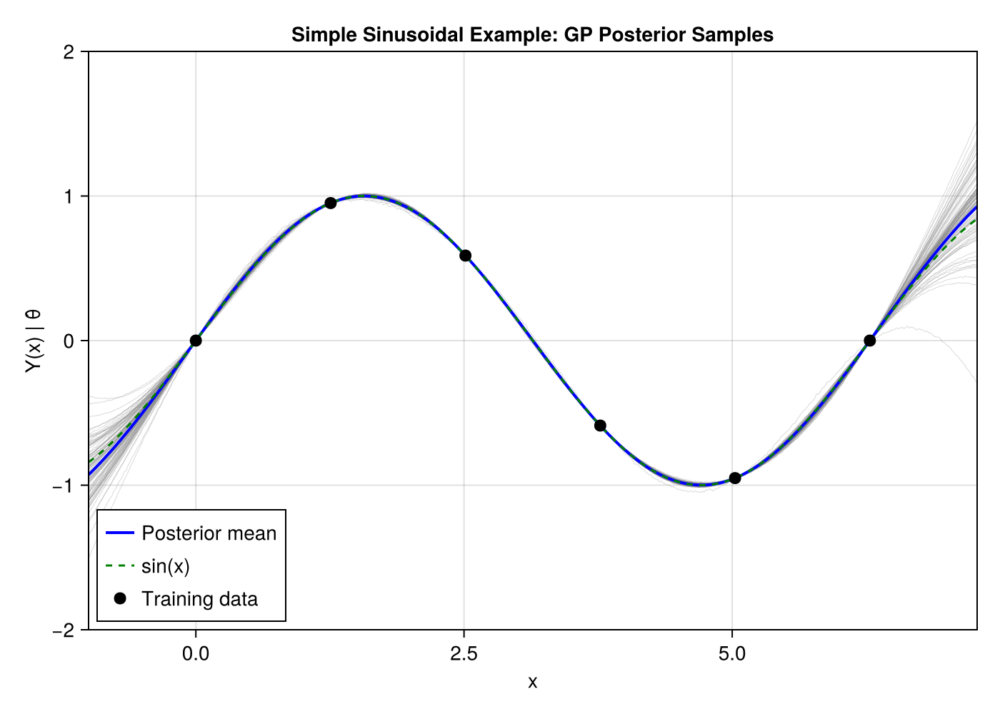

# Posterior Sampling Example

This example demonstrates GP posterior sampling using the full covariance matrix, fitting a sparse sinusoidal dataset.

## Overview

We will:
1. Fit an isotropic GP to sparse sinusoidal data
2. Use `pred_gp(lite=false)` to get the full posterior covariance
3. Draw posterior samples from the GP
4. Visualize the posterior uncertainty

## Setup

```julia
using laGP
using Distributions
using LinearAlgebra
using Random

Random.seed!(42)
```

## Generate Training Data

Create sparse observations from sin(x):

```julia
# Sparse training points over [0, 2π]
X_train = reshape([0.5, 1.5, 2.5, 3.5, 5.0, 6.0], :, 1)
Y_train = sin.(X_train[:, 1])

println("Training data:")
println("  X: ", vec(X_train))
println("  Y: ", Y_train)
```

## Fit Isotropic GP

```julia
# Initial hyperparameters
d_init = 2.0   # lengthscale
g_init = 1e-6  # small nugget for near-interpolation

# Create GP
gp = new_gp(X_train, Y_train, d_init, g_init)

# MLE for lengthscale only (keep small nugget fixed)
mle_gp(gp, :d; tmax=20.0)

println("Optimized hyperparameters:")
println("  d = ", gp.d)
println("  g = ", gp.g)
println("  log-likelihood = ", llik_gp(gp))
```

## Full Posterior Prediction

Get the full covariance matrix for sampling:

```julia
# Dense test grid
xx = collect(range(-0.5, 2π + 0.5, length=200))
XX = reshape(xx, :, 1)

# Get full posterior (lite=false returns GPPredictionFull)
pred_full = pred_gp(gp, XX; lite=false)

println("Prediction:")
println("  Test points: ", length(xx))
println("  Sigma size: ", size(pred_full.Sigma))
```

## Draw Posterior Samples

```julia
# Create multivariate normal distribution
mvn = MvNormal(pred_full.mean, Symmetric(pred_full.Sigma))

# Draw samples
n_samples = 50
samples = rand(mvn, n_samples)

println("Posterior samples: ", size(samples))
```

## Visualization (with CairoMakie)

```julia
using CairoMakie

fig = Figure(size=(700, 500))
ax = Axis(fig[1, 1],
    xlabel="x",
    ylabel="Y(x) | θ̂",
    title="GP Posterior Samples"
)

# Draw posterior samples (gray, semi-transparent)
for i in 1:n_samples
    lines!(ax, xx, samples[:, i], color=(:gray, 0.3), linewidth=0.5)
end

# Draw posterior mean (blue)
lines!(ax, xx, pred_full.mean, color=:blue, linewidth=2, label="Posterior mean")

# Draw true function (dashed green)
lines!(ax, xx, sin.(xx), color=:green, linewidth=1.5, linestyle=:dash, label="sin(x)")

# Draw training points (black circles)
scatter!(ax, vec(X_train), Y_train, color=:black, markersize=12, label="Training data")

axislegend(ax, position=:lb)
xlims!(ax, -0.5, 2π + 0.5)
ylims!(ax, -2.0, 2.0)

fig
```

The resulting visualization shows the posterior samples with the GP mean and true function:



## Key Concepts

### Posterior Mean and Variance

The posterior mean interpolates the training data (due to small nugget), while the variance:
- Is near zero at training points
- Increases between and beyond training points
- Reflects uncertainty about the true function

### Posterior Samples

Each sample represents a plausible function consistent with:
- The training data
- The GP prior (smoothness encoded by kernel)
- The estimated hyperparameters

### Practical Notes

1. **Nugget size**: A very small nugget (1e-6) gives near-interpolation. Increase for noisy data.
2. **Memory**: Full covariance requires O(n²) storage. For large test sets, use `lite=true`.
3. **Numerical stability**: The covariance matrix may need symmetrization before sampling.

## Credible Intervals

Instead of sampling, you can compute pointwise intervals:

```julia
using Distributions: TDist, quantile

# 95% credible intervals using Student-t distribution
t_dist = TDist(pred_full.df)
t_crit = quantile(t_dist, 0.975)

# Standard deviation at each point
std_pred = sqrt.(diag(pred_full.Sigma))

# Intervals
lower = pred_full.mean .- t_crit .* std_pred
upper = pred_full.mean .+ t_crit .* std_pred
```

This is more efficient than sampling when you only need intervals.
