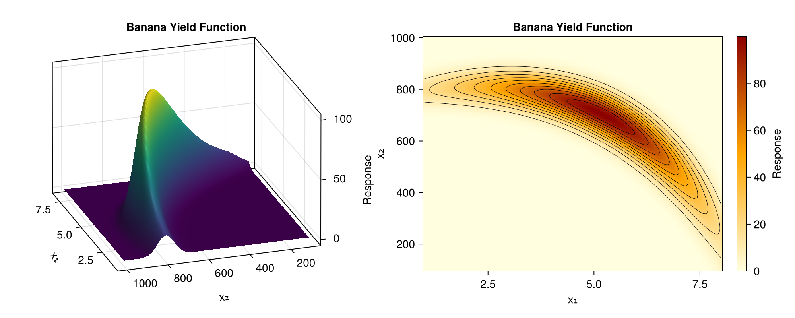
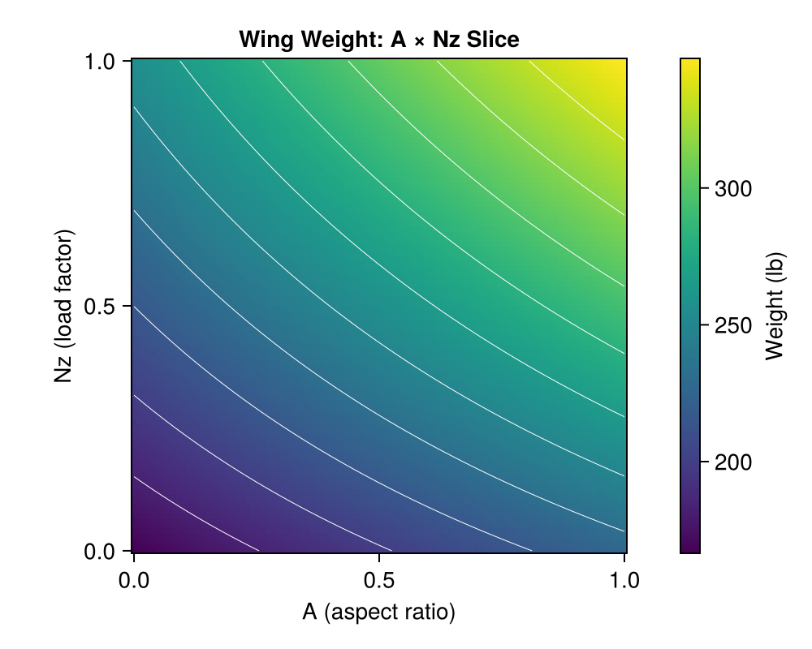
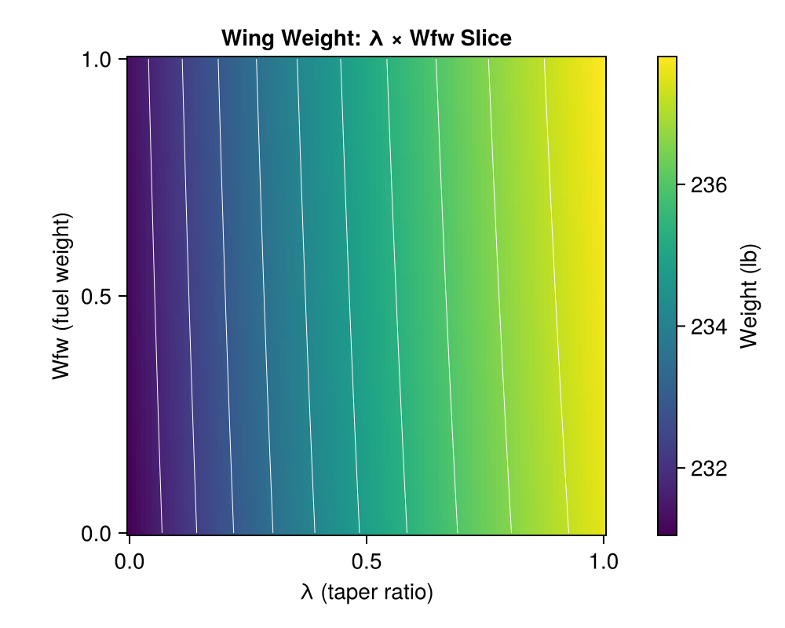

# Wing Weight Surrogate Example

This example demonstrates GP surrogate modeling using the aircraft wing weight simulator from Chapter 1 of "Surrogates" by Robert Gramacy.

## Overview

We will:
1. Build a GP surrogate for a 9-dimensional wing weight function
2. Compare isotropic vs separable (ARD) GP models
3. Perform main effects/sensitivity analysis
4. Visualize predictions on 2D slices

## Setup

```julia
using laGP
using Random
using LatinHypercubeSampling
using Statistics: mean

Random.seed!(42)
```

## Wing Weight Simulator

The simulator computes aircraft wing structural weight based on 9 design parameters:

```julia
function wingwt(; Sw=0.48, Wfw=0.4, A=0.38, L=0.5, q=0.62,
                  l=0.344, Rtc=0.4, Nz=0.37, Wdg=0.38)
    # Transform coded [0,1] inputs to natural units
    Sw_nat = Sw * (200 - 150) + 150       # Wing area (ft²)
    Wfw_nat = Wfw * (300 - 220) + 220     # Fuel weight (lb)
    A_nat = A * (10 - 6) + 6              # Aspect ratio
    L_nat = (L * 20 - 10) * π / 180       # Sweep angle (rad)
    q_nat = q * (45 - 16) + 16            # Dynamic pressure (lb/ft²)
    l_nat = l * 0.5 + 0.5                 # Taper ratio
    Rtc_nat = Rtc * 0.1 + 0.08            # Thickness ratio
    Nz_nat = Nz * 3.5 + 2.5               # Load factor
    Wdg_nat = Wdg * 800 + 1700            # Gross weight (lb)

    # Wing weight formula
    W = 0.036 * Sw_nat^0.758 * Wfw_nat^0.0035
    W *= (A_nat / cos(L_nat)^2)^0.6
    W *= q_nat^0.006 * l_nat^0.04
    W *= (100 * Rtc_nat / cos(L_nat))^(-0.3)
    W *= (Nz_nat * Wdg_nat)^0.49

    return W
end

# Variable names
var_names = ["Sw", "Wfw", "A", "L", "q", "l", "Rtc", "Nz", "Wdg"]

# Cessna C172 baseline
baseline = [0.48, 0.4, 0.38, 0.5, 0.62, 0.344, 0.4, 0.37, 0.38]
```

## Generate Training Data

Use Latin Hypercube Sampling for space-filling design:

```julia
n = 1000
plan, _ = LHCoptim(n, 9, 10)
X = Matrix{Float64}(plan ./ n)

# Evaluate simulator
Y = [wingwt(Sw=X[i,1], Wfw=X[i,2], A=X[i,3], L=X[i,4],
            q=X[i,5], l=X[i,6], Rtc=X[i,7], Nz=X[i,8], Wdg=X[i,9])
     for i in 1:n]

println("Training data: $n points in 9 dimensions")
println("Response range: [$(round(minimum(Y), digits=2)), $(round(maximum(Y), digits=2))] lb")
```

Example response surfaces from Chapter 1:




The Latin Hypercube design provides space-filling coverage:


## Fit Isotropic GP

```julia
# Get hyperparameter ranges
d_range = darg(X)
g_range = garg(Y)

# Fit isotropic GP
gp_iso = new_gp(X, Y, d_range.start, g_range.start)
jmle_gp!(gp_iso; drange=(d_range.min, d_range.max), grange=(g_range.min, g_range.max))

println("Isotropic GP:")
println("  d = $(round(gp_iso.d, sigdigits=4))")
println("  g = $(round(gp_iso.g, sigdigits=4))")
println("  log-likelihood = $(round(llik_gp(gp_iso), digits=2))")
```

## Fit Separable GP

```julia
# Per-dimension lengthscale ranges
d_range_sep = darg_sep(X)

d_start_sep = [r.start for r in d_range_sep.ranges]
d_ranges_sep = [(r.min, r.max) for r in d_range_sep.ranges]

# Fit separable GP
gp_sep = new_gp_sep(X, Y, d_start_sep, g_range.start)
jmle_gp_sep!(gp_sep; drange=d_ranges_sep, grange=(g_range.min, g_range.max))

println("Separable GP:")
println("  Lengthscales:")
for (j, name) in enumerate(var_names)
    println("    $name: $(round(gp_sep.d[j], sigdigits=4))")
end
println("  g = $(round(gp_sep.g, sigdigits=4))")
println("  log-likelihood = $(round(llik_gp_sep(gp_sep), digits=2))")
```

## Compare on 2D Slice

Predict on A (aspect ratio) × Nz (load factor) slice:

```julia
n_pred = 100
x_pred = range(0.0, 1.0, length=n_pred)

# Create prediction grid (vary A and Nz, fix others at baseline)
XX = Matrix{Float64}(undef, n_pred^2, 9)
for i in 1:n_pred^2
    XX[i, :] .= baseline
end

idx = 1
for nz in x_pred
    for a in x_pred
        XX[idx, 3] = a   # A
        XX[idx, 8] = nz  # Nz
        idx += 1
    end
end

# Predictions
pred_iso = pred_gp(gp_iso, XX; lite=true)
pred_sep = pred_gp_sep(gp_sep, XX; lite=true)

# True values for comparison
true_vals = [wingwt(Sw=baseline[1], Wfw=baseline[2], A=a, L=baseline[4],
                    q=baseline[5], l=baseline[6], Rtc=baseline[7], Nz=nz, Wdg=baseline[9])
             for a in x_pred, nz in x_pred]

# RMSE
rmse_iso = sqrt(mean((vec(true_vals) .- pred_iso.mean).^2))
rmse_sep = sqrt(mean((vec(true_vals) .- pred_sep.mean).^2))

println("A × Nz slice RMSE:")
println("  Isotropic: $(round(rmse_iso, digits=4)) lb")
println("  Separable: $(round(rmse_sep, digits=4)) lb")
```

2D slice visualizations of the wing weight function:





Isotropic vs Separable GP comparison on the A×Nz slice:


## Main Effects Analysis

Compute sensitivity of each input while holding others at baseline:

```julia
n_me = 100
x_me = range(0.0, 1.0, length=n_me)

main_effects = Matrix{Float64}(undef, n_me, 9)

for j in 1:9
    # Create prediction matrix
    XX_me = repeat(baseline', n_me, 1)
    XX_me[:, j] = collect(x_me)

    # Predict using separable GP
    pred_me = pred_gp_sep(gp_sep, XX_me; lite=true)
    main_effects[:, j] = pred_me.mean
end

# Report sensitivity (range of main effect)
println("Variable sensitivity (range of main effect):")
for j in 1:9
    effect_range = maximum(main_effects[:, j]) - minimum(main_effects[:, j])
    println("  $(var_names[j]): $(round(effect_range, digits=2)) lb")
end
```

## Visualization (with CairoMakie)

```julia
using CairoMakie

# Main effects plot
fig = Figure(size=(800, 500))
ax = Axis(fig[1, 1],
    xlabel="Coded Input [0, 1]",
    ylabel="Wing Weight (lb)",
    title="Main Effects Analysis"
)

colors = [:blue, :red, :green, :orange, :purple, :brown, :pink, :gray, :cyan]

for j in 1:9
    lines!(ax, collect(x_me), main_effects[:, j],
           color=colors[j], linewidth=2, label=var_names[j])
end

Legend(fig[1, 2], ax, nbanks=1)
fig
```

The main effects analysis reveals input sensitivities:


## Key Findings

1. **Most influential inputs**: Sw (wing area), A (aspect ratio), Nz (load factor)
2. **Least influential inputs**: l (taper ratio), Wfw (fuel weight)
3. **Isotropic vs Separable**: For smooth functions, both may converge to similar predictions
4. **Lengthscale interpretation**: Smaller lengthscale = more sensitive input

## Surrogate Benefits

- **Speed**: Surrogate predictions are instantaneous vs expensive simulations
- **Optimization**: Use GP for derivative-free optimization
- **Uncertainty**: Predictive variance quantifies surrogate accuracy
- **Sensitivity**: Lengthscales directly indicate input importance
